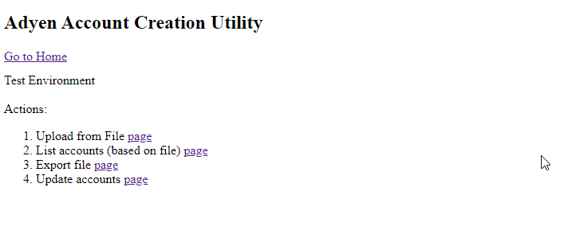

# adyen-account-creation
Small utility supporting bulk creation of Adyen Console users.


## Prerequisite 
 - Docker + Docker compose
 - Java 17

## How it works:
 - takes EXCEL file as input (last name , email, user name , roles)
 - executes Adyen User Management API
 - produces EXCEL file wuth user created accounts and passwords as output
 - uses MySql DB as a storage
 - provides ability to debug/troubleshoot every step and re-run if needed 


## Steps

### Run it locally or from IDE 

Start MYSQL DB container first
```
docker container run --name mysqldb -p 3306:3306 -e MYSQL_ROOT_PASSWORD=root -e MYSQL_DATABASE=mysqldb -e MYSQL_USER=user -e MYSQL_PASSWORD=password -d mysql:8.0
```

Run App either from IDE or as a Gradle tasks

```
./gradlew bootRun -Denv=test
```


### Run in containers 

```
docker container up --build
```

